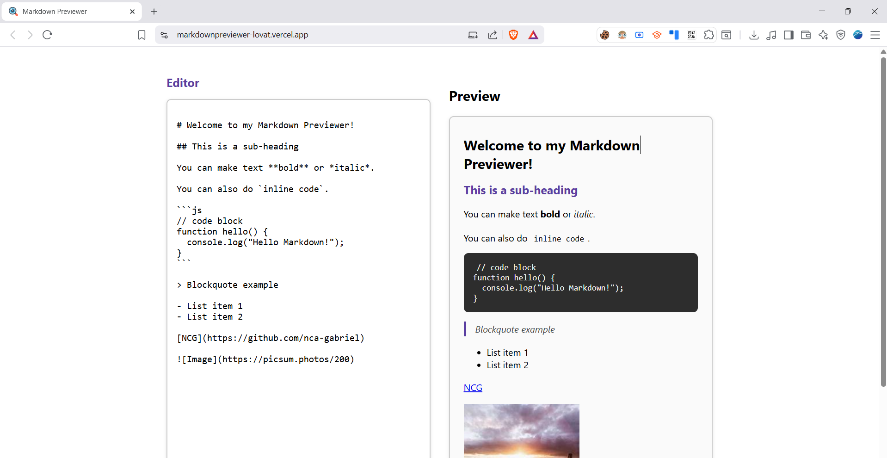

<p align="center">
  <a href="https://markdownpreviewer-lovat.vercel.app" target="_blank">
    
  </a>
</p>

<h1 align="center">MarkdownPreviewer</h1>

<p align="center">
  <a href="https://markdownpreviewer-lovat.vercel.app" target="_blank">Live Demo</a> •
  <a href="#project-description">Project Description</a> •
  <a href="#features">Features</a> •
  <a href="#tech-stack">Tech Stack</a> •
  <a href="#installation">Installation</a> •
  <a href="#usage">Usage</a>
</p>



---

## Project Description

MarkdownPreviewer is a **clean and efficient web app** that allows users to type Markdown and instantly see the formatted output. Built using **Create React App**, it delivers a seamless live preview experience for Markdown editing.

🔗 [Live Demo](https://markdownpreviewer-lovat.vercel.app)

---

## Features

- Live Markdown editing with real-time preview
- Supports standard Markdown syntax (headings, lists, links, code blocks, etc.)
- Clear and intuitive layout
- Responsive design—works well on both mobile and desktop

---

## Tech Stack

- **Frontend**: React (Create React App)
- **Styling**: CSS
- **Deployment**: Vercel

---

## Installation

```bash
git clone https://github.com/nca-gabriel/markdownpreviewer.git
cd markdownpreviewer
npm install
```
---


## Usage

Start the development server:

```bash
npm run dev
```
